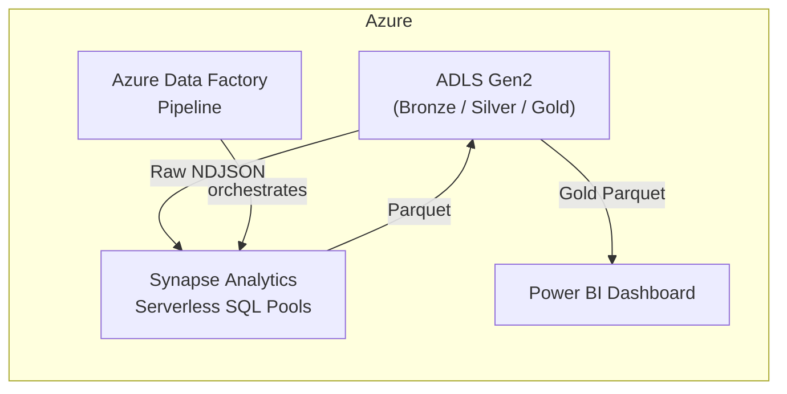

# 📊 Ad‑Tech ETL Pipeline on Azure

*A fully‑serverless, production‑ready data pipeline for advertising performance analytics*

---

  

> **TL;DR** – This repository contains the code, scripts, and architecture for an end‑to‑end ETL pipeline that ingests raw JSON ad‑performance data, transforms it using Synapse Serverless, and surfaces curated, analytics‑ready tables to Power BI – all orchestrated with Azure Data Factory.

---

## 📚 Table of Contents

1. [Project Goals](#project-goals)
2. [Architecture Overview](#architecture-overview)
3. [Technology Stack](#technology-stack)
4. [Pipeline Execution Flow](#pipeline-execution-flow)
5. [Data Model – Medallion Architecture](#data-model--medallion-architecture)
6. [Setup & Deployment](#setup--deployment)
7. [Key Challenges & Solutions](#key-challenges--solutions)
8. [Roadmap](#roadmap)
9. [Contributing](#contributing)
10. [License](#license)

---

## 🎯 Project Goals

* **Single Source of Truth** – Consolidate multi‑platform ad data into a unified, query‑ready model.
* **Cost‑Efficient & Scalable** – Leverage Azure’s pay‑as‑you‑go, serverless services to minimise idle spend.
* **Production‑Grade** – Include idempotency, robust security (Managed Identities), and automated orchestration.
* **BI‑Ready** – Deliver daily campaign KPIs such as ROAS directly to Power BI for self‑service analytics.

---

## 🏗️ Architecture Overview



* **Serverless‑Only** – No long‑running clusters or dedicated SQL pools.
* **Sequential orchestration** ensures data integrity with built‑in retry & error handling.

---

## 🛠️ Technology Stack

| Layer         | Service                                | Details                                     |
| ------------- | -------------------------------------- | ------------------------------------------- |
| Storage       | **Azure Data Lake Storage Gen2**       | Raw (NDJSON) & curated (Parquet) zones      |
| Transform     | **Azure Synapse Serverless SQL Pools** | T‑SQL cleansing, type‑casting, aggregations |
| Orchestration | **Azure Data Factory**                 | Pipeline `PL_Daily_Ad_Performance_ETL`      |
| Modelling     | **Medallion (Bronze/Silver/Gold)**     | Incremental refinement pattern              |
| Reporting     | **Power BI**                           | DirectLake/Import mode                      |
| Scripting     | `Python`                               | Sample‑data generator                       |

---

## ⚙️ Pipeline Execution Flow

1. **Setup Data Sources** – Creates `MASTER KEY` & `EXTERNAL DATA SOURCE` objects pointing to ADLS containers.
2. **Delete Old Silver Data** – Ensures idempotency by removing yesterday’s Parquet partitions.
3. **Bronze → Silver ETL** – Cleans NDJSON, enforces schema, writes partitioned Parquet to **Silver**.
4. **Delete Old Gold Data** – Clears previous aggregates.
5. **Silver → Gold ETL** – Aggregates campaign‑level KPIs, outputs Parquet optimised for BI.

> All steps run inside a single ADF pipeline for ease of monitoring and alerting.

---

## 🗂️ Data Model – Medallion Architecture

| Layer      | Storage Path                              | Purpose                              |
| ---------- | ----------------------------------------- | ------------------------------------ |
| **Bronze** | `adls://bronze/<date>/ad_data.ndjson`     | Immutable raw ingest                 |
| **Silver** | `adls://silver/ad_performance/`           | Cleansed, typed, partitioned Parquet |
| **Gold**   | `adls://gold/daily_campaign_performance/` | BI‑ready daily aggregates            |

---

## 🚀 Setup & Deployment

```bash
# 1️⃣ Clone repo & install deps
$ git clone https://github.com/<your‑org>/ad-tech-etl-pipeline.git
$ cd ad-tech-etl-pipeline

# 2️⃣ Generate sample data & upload to Bronze (local run)
$ python data_generator/upload_ad_data.py --account <storage‑acct> --container bronze

# 3️⃣ Deploy Azure resources (ARM/Bicep coming soon)
# az deployment group create ...

# 4️⃣ Import ADF pipeline JSON via Azure Portal & Publish
```

> **Tip:** For CI/CD, export the ADF ARM template after publishing and plug it into your pipeline of choice (GitHub Actions / Azure DevOps).

---

## 🧩 Key Challenges & Solutions

| Challenge                                         | Solution                                                                    |
| ------------------------------------------------- | --------------------------------------------------------------------------- |
| *OPENROWSET row‑size limits with multi‑line JSON* | Switched to **NDJSON** format – one JSON object per line.                   |
| *Complex cross‑service permissions*               | Implemented **Azure Managed Identities** + explicit RBAC on ADLS & Synapse. |
| *Non‑idempotent external table creates*           | Added ADF **Delete** activities before each ETL stage.                      |

---

## 🗺️ Roadmap

* [ ] Infrastructure‑as‑Code (Bicep) templates
* [ ] Unit & integration tests (t‑SQLt / pytest‑sql)
* [ ] CI/CD via GitHub Actions
* [ ] Cost‑monitoring dashboards

---

## 🤝 Contributing

PRs are welcome! Please open an issue first to discuss major changes. Make sure CI passes and commit messages follow **Conventional Commits**.

---

